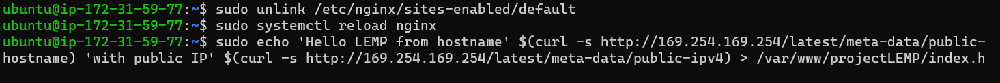

## Detailed documentation of Project2

### INSTALLING THE NGINX WEB SERVER

`sudo apt update`

`sudo apt install nginx`

*To verify that nginx was successfully installed and is running as a service in Ubuntu*

`sudo systemctl status nginx`

*To access the server locally in our Ubuntu shell*

 `curl http://localhost:80`
 

 `curl http://127.0.0.1:80`
 

*To test how our Nginx server can respond to requests from the Internet*

[Nginx Server response to request](http://ec2-100-26-212-185.compute-1.amazonaws.com/)

*To retrieve your Public IP address on terminal*

`curl -s http://169.254.169.254/latest/meta-data/public-ipv4`

### INSTALLING MYSQL

`sudo apt install mysql-server`

*To log in to the MySQL console*

`sudo mysql`

*To set a password for the root user*

`ALTER USER 'root'@'localhost' IDENTIFIED WITH mysql_native_password BY 'PassWord.1';`

*To exit the MySQL shell*

`exit`

*To start the interactive script*

`sudo mysql_secure_installation`

*To test log in access in to the MySQL console and to exit the console*

`sudo mysql -p`
`exit`

### INSTALLING PHP

*To install PHP components- php-fpm, which stands for “PHP fastCGI process manager” which tell Nginx to pass PHP requests to this software for processing, and php-mysql, a PHP module that allows PHP to communicate with MySQL-based databases*

`sudo apt install php-fpm php-mysql`

### CONFIGURING NGINX TO USE PHP PROCESSOR

*To create the root web directory for my domain*

`sudo mkdir /var/www/projectLEMP`

*To assign ownership of the directory with the $USER environment variable, which will reference your current system user*

`sudo chown -R $USER:$USER /var/www/projectLEMP`

*To open a new configuration file in Nginx’s sites-available directory*

`sudo nano /etc/nginx/sites-available/projectLEMP`

*To activate your configuration*

`sudo ln -s /etc/nginx/sites-available/projectLEMP /etc/nginx/sites-enabled/`

*To test the configuration for syntax errors*

`sudo nginx -t`

*To disable default Nginx host that is currently configured to listen on port 80*

`sudo unlink /etc/nginx/sites-enabled/default`

*To reload Nginx*

`sudo systemctl reload nginx`

*To create an index.html file in that location*

`sudo echo 'Hello LEMP from hostname' $(curl -s http://169.254.169.254/latest/meta-data/public-hostname) 'with public IP' $(curl -s http://169.254.169.254/latest/meta-data/public-ipv4) > /var/www/projectLEMP/index.html`

*To open your website URL using IP address*

[To access website using IP address](http://100.26.212.185:80)

*To open your website URL using DNS name*

[To access website using DNS name](http://http://ec2-100-26-212-185.compute-1.amazonaws.com/:80)

